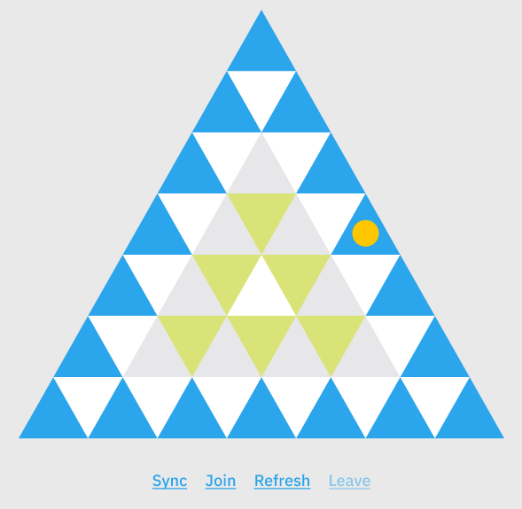

## Tripoly

We want to create a decentralized board-game on Tezos, to educate people about renewable and sustainable projects in a playful and interactive way. We want to disrupt the game idea of Monopoly and turn its values around, from capitalism and re-shape it for the future of web3 to an open source knowledge game using the conventions and the features of the metaverse.

This is the project presentation pdf: [Tzconnect_hackathon_2021_Klodie_&_Marcel.pdf](Tzconnect_hackathon_2021_Klodie_&_Marcel.pdf)

Each playing field represents a room. An AR experience as the asset of the NFT associated with that field. Maybe we can mint .USDZ and iPhone users can directly jump in the virtual world. These models are interactive.

### Deployment

The most recent contract is deployed here https://better-call.dev/hangzhou2net/KT19hqf8T654T3sFxRJpsULTtimqyGYK7Lhk

The frontend is running here: https://tripoly.vinzenzaubry.com/

A list of all projects that are featured within Tripoly are listed here https://docs.google.com/spreadsheets/d/14lT92V5NXHRhLmGlB0faUw2Ako9qKdmIUlRZWAojz_0/edit?usp=sharing

A basic video of how to use it here: [images/walkthrough_video.mp4](images/walkthrough_video.mp4)

### Code

Our game contract source code is [main.mligo](tripoly/main.mligo)

The frontend code is in the submodule called "webapp".

More development guidance in [DEVELOPMENT.md](DEVELOPMENT.md)

#### Project submission mechanism
Once all projects from a field are sold out, it's time to refill the game, so it can continue. There will be a separate mechanism for that, a submission contract.

The submission contract will be a superset of a FA2 token minter. Any player can mint a token that includes basic data as name, description, 3d file (usdz), image and price in XTZ. This token will be minted and after an approval stage with a curator (dao, voting?) placed in a waiting queue. Once a playing field / a project has been supported by a player, it is sold out and will automatically be replaced by a new project from the waiting list.

### Team members

    Marcel Schwittlick 
    Artist & Developer
    http://schwittlick.net/
    Twitter: https://twitter.com/schwittlick_

    Klodie Zengbé 
    Content creator, Photographer & Strategist    
    https://www.klodiezengbe.com/
    Twitter: https://twitter.com/klod_i_e

    Vinzenz Aubry 
    Artist & Developer
    https://vinzenzaubry.com/
    Twitter: https://twitter.com/vinberto

Berlin, 2021