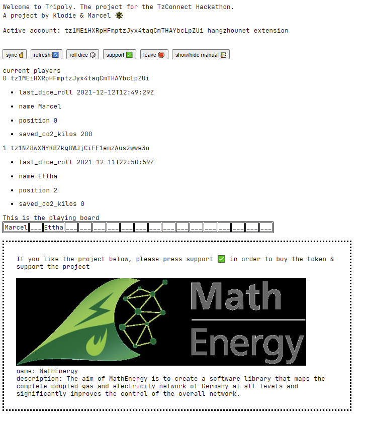

## tripoly

We want to create a decentralized board-game on Tezos, to educate people about renewable and sustainable projects in a playful and interactive way. We want to disrupt the game idea of Monopoly and turn its values around, from capitalism and re-shape it for the future of web3 to an open source knowledge game using the conventions and the features of the metaverse.

This is the project presentation pdf: [Tzconnect_hackathon_2021_Klodie_&_Marcel.pdf](Tzconnect_hackathon_2021_Klodie_&_Marcel.pdf)

Each playing field represents a room. An AR experience as the asset of the NFT associated with that field. Maybe we can mint .USDZ and iPhone users can directly jump in the virtual world. These models are interactive.

### deployment

The most recent contract is deployed here https://better-call.dev/hangzhou2net/KT1JwJcQnzDLbpsLkQ1nyVJvM3Jru8cXJ8fh

The frontend is running here: https://schwittlick.net/tzconnect_hackathon/

A basic video of how to use it here: [images/walkthrough_video.mp4](images/walkthrough_video.mp4)

### code

Our game contract source code is [tripoly/main.mligo](./tripoly/main.mligo).

The frontend code is [frontend/index.html](./frontend/index.html)

### next steps for making the game a real product

    1. balance game parameters (timeout, bounty, amount of playing fields, nft prices etc)
    2. per field 3 nfts with multiple editions ( research, proto etc)
    3. activity fields (go back to start without bounty etc), to avoid/reduce the possibility for people to play only to get tezos by making rounds
    4. market place to trade supported projects (secondary market)
    5. how to refill the game? reset mode? 
    6. people could be able to vote for which project include in the field
    7. fix random number problem
    8. frontend needs to be responsibe and dynamic
    9. a round based mechanism, so all players are in sync, nobody can roll more than others
    10. calculate saved co2 depending on how many nfts collected
    11. create leaderboard of people who saved the most co2 by supporting projects
    12. when you join the game it should cost a small fee
    13. add a refill entrypoint to stock up on funds
    14. send nft price to the contract instead of owner
    15. branding & communication to talk about the project

### notes

We are making use of OpenMinter to mint tokens. Also we are using the nftshop contract from the tacode tutorial.

For this we mint tokens, send them by hand to our contract. Before we do that, we need to mint all tokens and send them to the storage of out contract after we deployed it with the storage containing all our minted token addresses.
Check [the storage file](./tripoly/main_storage.mligo)
Once this is complete it's possible to interact with our contract via it's 'Support' entry point. This call needs to have the same amount associated than the price of the token.

### questions

    2. how to make a fake pseudo random nr somehow?
    3. how to sync all players, how long is a "round", how to timeout and what kind of bounties for "passive" playing (by joining the game and not rolling the dice, afk, etc)?
       1. how to make sure the others can continue playing?
    4. how to write tests for this?!
    5. How do we force ipfs download as .usdz file fromt frontend?

### main.mligo iteration log

    first contract -> KT1ChmfSbutmeGLpGqX6J7X1vZpyuh943uuM
    second contract, with dice -> KT1TDAToeMYtkv8bJ2jxGRBVZFZ1pTZcUMvX
    third iteration, with name only, new position modulo -> KT1Ct1TJ6NPjPN1pfo428392rw9ScBQXXjKS
    fourth iteration, simple saved co2 field -> KT18rNgBjupzv9YHw2nhu6PeuJrkNMzcATAL
    5. iteration, conditional co2 saved -> KT1PjELyh37MW8p6ui6aQWQPmgFWRCuP3shd
    6. iteration, no empty name allowed when using join endpoint -> KT1CoosHHw5zSDUueBSiiEM876bfq1hVagai
    7. iteration, when over start, receive some tezzi -> KT1RgSCkbBuBvygQ5ne2fZKgshXJCLneMHjB
    8. iteration, originated with some initial tez, can't send anything to the contract above :/ KT1NJLH1HkLPMogd2nG6amAxd193tfbo9YwU
    9. iteration, checking for Tezos.balance before attempting -> KT1LyYzJ6hm9Piqh3QubV1RxYJxeCFHPG6Ax
    10. iteration, adding fields map to storage -> KT1HGJraHkJTv3Q9azGRMBoQy5oidJVKg951
    11. iteration, implements SetField admin endpoint -> KT1Q6HpqNdyNSfwkh4SaEyJNcZnK2ZrVhcsQ
    12. adds barebones for 5min timeout for interaction. exposes dice call *dangerours* -> KT1Xk425atpHjnBin1fgjXvumWyLssSpg6p4
    13. it seems it worked, make a real test edition: KT1UGSYe6TB5RkANKyHe7SJvsutPDwJVWbv6
    14. dice should be 1 <= nr <= 6 -> KT1T4eNM8APgQnuiy8Z2kjeEFT9XJTiUebk2
    15. changes field record, now using stock, token addr, tez price -> KT1Js7LVjGw8L6yLYGaB36fdZw2qnapA3Fm6
    16. included the nft shop code as an endpoint: -> KT1QiT73UPVmoDGZX6Qxpkhrqmsn4UzwarPt. i sent the nft to this address. then i can buy it and it works :)))))
    17. made a check, cant play when nfts not finished initializing. -> KT1H2P27NYGZPrLJfoR2tuxL3HdcXVgDdbWx
    18. deployed the same contract with 18 test nfts as storage -> KT1FmuDmRD1to4GcVHSYAZgBEccCNNdjY7Gp. again, i've sent the nft of the collection KT1CE144SvpAv4iUQb8Zey4M3SKQQEV9DWMd to the contract and bought it via the support endpoint
    19. final KT1JwJcQnzDLbpsLkQ1nyVJvM3Jru8cXJ8fh

    20. add Refill endpoint (kinda cosmetic)
    21. receive money from nft purchase into contract address
    22. add supported fields list to player and co2 multiplier to field -> KT1K7yF9Vpst3gBydKf1YAuAWAE3V82Gje8G
    23. calculating co2 multiplier -> KT1UDTABPDiXU6swCAc3We5DdkBv2hN2kxPX
    24. adding debug flag and updating supported fields storage of player -> KT1KxSmjBQiuY6yLc5c1KaRgWMrsKZePbt5T

    25. minted .usdz file, added to game

### integration tests?!

    ligo dry-run main.mligo main 'Join("Marcel")' "`cat main_storage.mligo`" --sender=tz1MEiHXRpHFmptzJyx4taqCmTHAYbcLpZUi --balance=10 --now='2021-01-01T10:10:10Z'
    ligo dry-run main.mligo main 'Leave()' "`cat main_storage.mligo`" --sender=tz1MEiHXRpHFmptzJyx4taqCmTHAYbcLpZUi --balance=10 --now='2021-01-01T10:10:10Z'
    ligo dry-run main.mligo main 'Dice(6n)' "`cat main_storage.mligo`" --sender=tz1MEiHXRpHFmptzJyx4taqCmTHAYbcLpZUi --balance=10 --now='2021-01-01T10:10:10Z'
    ligo dry-run main.mligo main 'Support()' "`cat main_storage.mligo`" --sender=tz1MEiHXRpHFmptzJyx4taqCmTHAYbcLpZUi --balance=10 --now='2021-01-01T10:10:10Z' --amount=1
    ligo dry-run main.mligo main 'Payout(10tz)' "`cat main_storage.mligo`" --sender=tz1MEiHXRpHFmptzJyx4taqCmTHAYbcLpZUi --balance=10 --now='2021-01-01T10:10:10Z'
    ligo dry-run main.mligo main 'Refill()' "`cat main_storage.mligo`" --sender=tz1MEiHXRpHFmptzJyx4taqCmTHAYbcLpZUi --balance=10 --now='2021-01-01T10:10:10Z' --amount=1

### pre-minted nfts (openminter)

    Use OpenMinter https://github.com/tqtezos/minter
    With wallet tz1MEiHXRpHFmptzJyx4taqCmTHAYbcLpZUi
    Created new collection TestCollectionHackathon (KT1N6GwCQMNWkHaAPKL6ZgLSgxi7Y26dLybX)
    Created new token: First Anti Monopoly NFT in KT1N6GwCQMNWkHaAPKL6ZgLSgxi7Y26dLybX (token 0)
    Created new token: First Anti Monopoly NFT in KT1N6GwCQMNWkHaAPKL6ZgLSgxi7Y26dLybX (token 1)
    Transferring token to KT1EdSL2bvgXBUedPq5d5R7SHbpk5EmHz9uW (transfer contract from tacode and back)
    Created new collection TestCollectionHackathonTwo (KT1Wpyqt4EP5vBYPxVWaPRRcSVCKL6S916xu)
    Created new token: First one of the second Anti Monopoly NFTS ꘐ in KT1Wpyqt4EP5vBYPxVWaPRRcSVCKL6S916xu
    Created new collection AnotherCollection (KT1VocMG4tjJgq3vzyZDBw8AAnJWTJv1Qusz)
    Created new token: What is this logo? in KT1VocMG4tjJgq3vzyZDBw8AAnJWTJv1Qusz
    Created new token: Third one in here. Maybe this has metadata? in KT1N6GwCQMNWkHaAPKL6ZgLSgxi7Y26dLybX (token 2)
    Created new collection CollectionWithTwo (KT1PtSQYch2QJoCE9pNPfFkB53fibyT7KL8m)
    Created new collection CollectionOfOne (KT1BhPfrdxVMeE1ftePCcH14nF1fyFSdJLxC)
    reated new collection Collection11 (KT1CE144SvpAv4iUQb8Zey4M3SKQQEV9DWMd)

    Created new collection AR_Project1 (KT1CGj16MiXEpmh5ab1RUY9FZDFuKH2NjtYB)